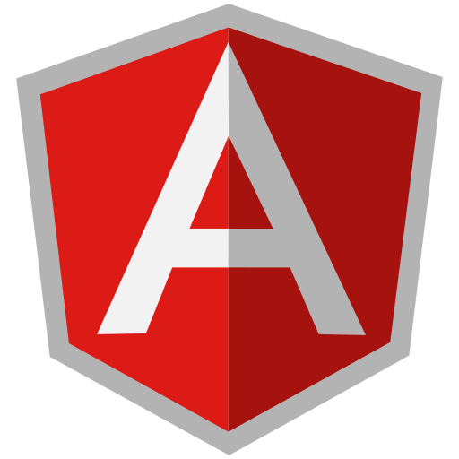
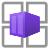

<h2 align="center">Hey everyone 👋 I'm James</h2>

- 👨‍💻 I'm currently a **Cloud Customer Engineer at Microsoft**
- 🏅 Previously recognized as a **[Microsoft MVP](https://mvp.microsoft.com/en-us/PublicProfile/5001534)** from 2015-2024
- 💬 Ask me about **AI/ML**, **cloud app development**, **cloud native**, **DevOps**, **[Azure](https://azure.microsoft.com/en-gb/)**, **[OpenAI](https://azure.microsoft.com/en-us/products/ai-services/openai-service)**, **[.NET](https://docs.microsoft.com/en-us/dotnet/)**, **[Python](https://www.python.org/)**, and **[TypeScript](https://www.typescriptlang.org/)**
- 📇 Connect on **[LinkedIn](https://www.linkedin.com/in/jmcroft/), and GitHub**
- 📃 Get access to my **[recommended articles and samples](./docs/README.md)**

 

<strong>Note: This is a private, personal account. Any code repositories created as jamesmcroft or MADE Apps are not directly linked with my work at Microsoft unless explicity stated.</strong>

<h3 align="center">Technologies & Tools ⚒️</h2>

|                       |                                                                                                                                                                                                             |                                                                                                                                                                                                                        |                                                                                                                                                                                         |
| --------------------- | ----------------------------------------------------------------------------------------------------------------------------------------------------------------------------------------------------------- | ---------------------------------------------------------------------------------------------------------------------------------------------------------------------------------------------------------------------- | --------------------------------------------------------------------------------------------------------------------------------------------------------------------------------------- |
| **Operating Systems** |                                        |                                                                                           |                                                  |
| **IDEs**              |                                                           |                                                          |                                    |
| **Design**            |                                                              |
| **Languages**         |                                                               |                                                                       |                                                        |
| **UI Frameworks**     |                                                          |                                                                                             |                                                   |
| **AI/ML**             |                  |                           |  |
| **Cloud Compute**     |              |                                |         |
| **Data**              |                         |                                             |
| **Integration**       |                       |                                     |
| **Monitoring**        |                                  |                                                                       |
| **Security**          |                             |  |
| **DevOps**            |                                     |                                                                                           |
| **Scripting**         |                             |                                                                                |
| **Office**            |  |
